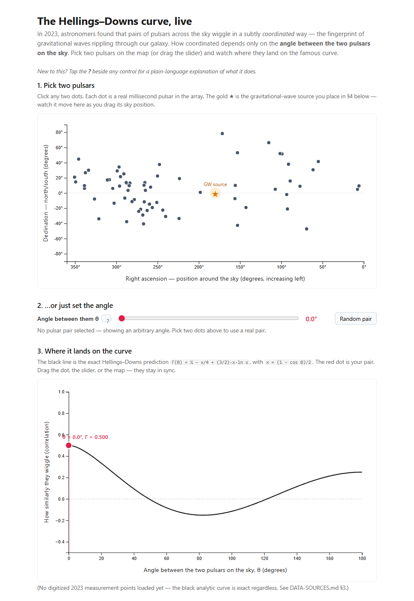

# pta-explainer

An interactive, browser-only explainer for how a pulsar timing array detects the
nanohertz gravitational-wave background, built around the 2023 NANOGrav 15-year
Hellings–Downs result.

**Live demo: <https://mepotts.github.io/pta-explainer/>**

Pick two of the 67 real NANOGrav 15-year pulsars (or drag an angle slider) and see where
the pair lands on the exact Hellings–Downs curve. A source sandbox then places one or two
illustrative supermassive black-hole binaries on the sky and draws the timing residuals they
imprint on six pulsars. These are example sources, not the real stochastic background, and
the 2023 measurement points are not overlaid.

## Where the source lives

This repository holds only the **built site** (generated output). The source, tests and
build configuration are in
[`pta-explainer/` in mepotts/astronomy](https://github.com/mepotts/astronomy/tree/main/pta-explainer)
(TypeScript, D3, Vite).

## How it was built and checked

Built by directing AI coding agents (Claude Code) under automated checks; Matthew Potts set
the direction and is accountable for the result. The source carries 64 Vitest tests, run in CI
alongside a type-checked production build. They cover the Hellings–Downs landmarks (Γ(0°) = 0.5,
zero crossing near 49.3°, minimum near 82.5°) with an independent stationary-point check,
sky-separation geometry, strain and residual scalings and linearity, a check that averaged
antenna patterns reproduce Hellings–Downs, and jsdom integration tests.

MIT-licensed. Pulsar positions derive from the NANOGrav 15-year Data Set (Agazie et al. 2023;
Zenodo 10.5281/zenodo.7967584), used under CC-BY-4.0. Independent educational tool, not
affiliated with or endorsed by NANOGrav.
